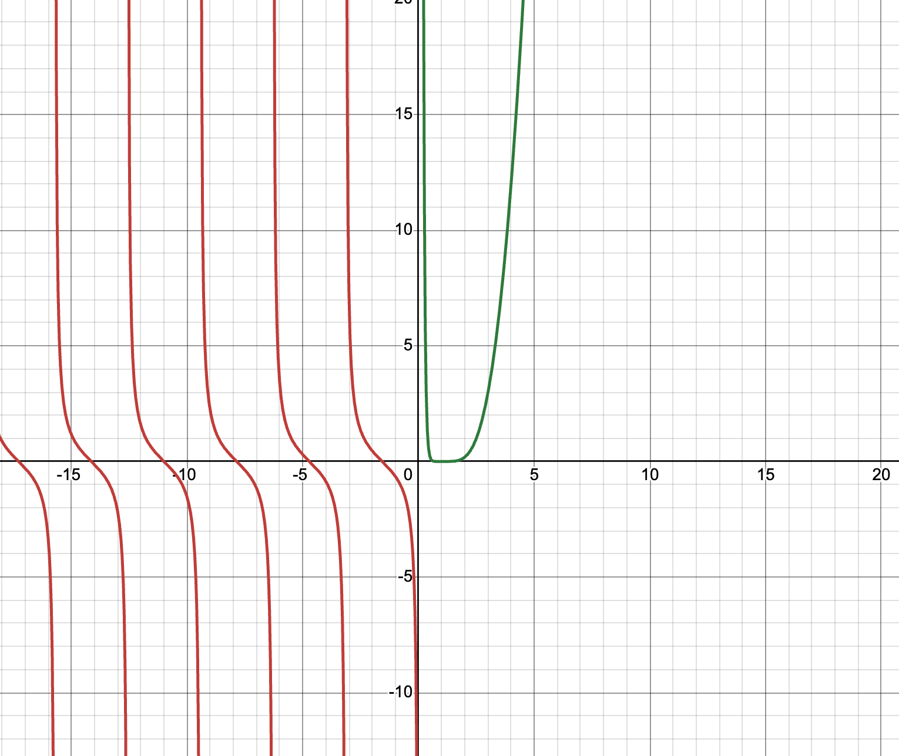
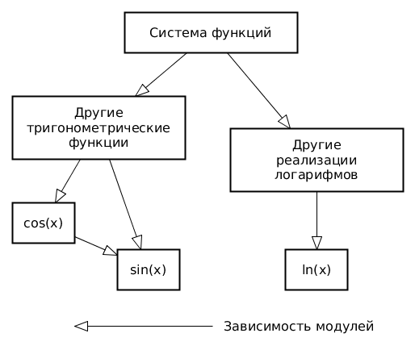
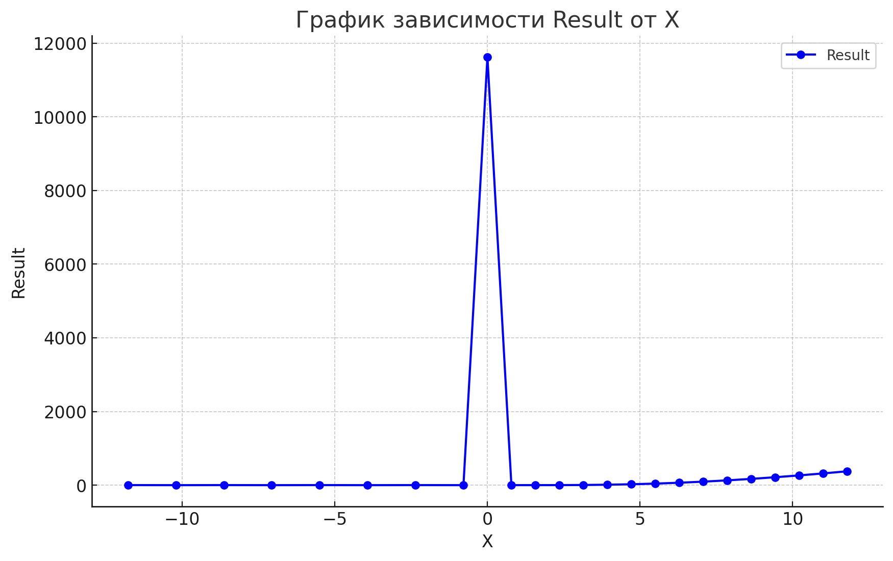

# Лабораторная №2
### Вариант 31012
## Задание
Провести интеграционное тестирование программы, осуществляющей вычисление системы функций (в соответствии с вариантом).

<math xmlns="http://www.w3.org/1998/Math/MathML">
  <mstyle displaystyle="true">
    <mrow>
      <mo>{</mo>
      <mtable columnalign="left">
        <mtr>
          <mtd>
            <mrow>
              <mo>(</mo>
              <mrow>
                <mo>(</mo>
                <mrow>
                  <mi>csc</mi>
                  <mrow>
                    <mo>(</mo>
                    <mi>x</mi>
                    <mo>)</mo>
                  </mrow>
                </mrow>
                <mo>&#x22C5;</mo>
                <mrow>
                  <mi>tan</mi>
                  <mrow>
                    <mo>(</mo>
                    <mi>x</mi>
                    <mo>)</mo>
                  </mrow>
                </mrow>
                <mo>)</mo>
              </mrow>
              <mo>&#x22C5;</mo>
              <mrow>
                <mo>(</mo>
                <mrow>
                  <mi>cos</mi>
                  <mrow>
                    <mo>(</mo>
                    <mi>x</mi>
                    <mo>)</mo>
                  </mrow>
                </mrow>
                <mo>&#x22C5;</mo>
                <mrow>
                  <mi>cot</mi>
                  <mrow>
                    <mo>(</mo>
                    <mi>x</mi>
                    <mo>)</mo>
                  </mrow>
                </mrow>
                <mo>)</mo>
              </mrow>
              <mo>)</mo>
            </mrow>
            <mrow>
              <mspace width="1ex" />
              <mo>if</mo>
              <mspace width="1ex" />
            </mrow>
            <mi>x</mi>
            <mo>&#x2264;</mo>
            <mn>0</mn>
          </mtd>
        </mtr>
        <mtr>
          <mtd>
            <mrow>
              <mo>(</mo>
              <mrow>
                <mo>(</mo>
                <msup>
                  <mrow>
                    <mo>(</mo>
                    <mrow>
                      <mo>(</mo>
                      <mfrac>
                        <mrow>
                          <mrow>
                            <msub>
                              <mi>log</mi>
                              <mn>2</mn>
                            </msub>
                            <mrow>
                              <mo>(</mo>
                              <mi>x</mi>
                              <mo>)</mo>
                            </mrow>
                          </mrow>
                          <mo>&#x22C5;</mo>
                          <mrow>
                            <msub>
                              <mi>log</mi>
                              <mn>5</mn>
                            </msub>
                            <mrow>
                              <mo>(</mo>
                              <mi>x</mi>
                              <mo>)</mo>
                            </mrow>
                          </mrow>
                        </mrow>
                        <mrow>
                          <msub>
                            <mi>log</mi>
                            <mn>5</mn>
                          </msub>
                          <mrow>
                            <mo>(</mo>
                            <mi>x</mi>
                            <mo>)</mo>
                          </mrow>
                        </mrow>
                      </mfrac>
                      <mo>)</mo>
                    </mrow>
                    <mo>&#x22C5;</mo>
                    <mrow>
                      <mo>(</mo>
                      <mrow>
                        <msub>
                          <mi>log</mi>
                          <mn>2</mn>
                        </msub>
                        <mrow>
                          <mo>(</mo>
                          <mi>x</mi>
                          <mo>)</mo>
                        </mrow>
                      </mrow>
                      <mo>-</mo>
                      <mrow>
                        <mo>(</mo>
                        <mrow>
                          <mi>ln</mi>
                          <mrow>
                            <mo>(</mo>
                            <mi>x</mi>
                            <mo>)</mo>
                          </mrow>
                        </mrow>
                        <mo>-</mo>
                        <mrow>
                          <mi>ln</mi>
                          <mrow>
                            <mo>(</mo>
                            <mi>x</mi>
                            <mo>)</mo>
                          </mrow>
                        </mrow>
                        <mo>)</mo>
                      </mrow>
                      <mo>)</mo>
                    </mrow>
                    <mo>)</mo>
                  </mrow>
                  <mn>3</mn>
                </msup>
                <mo>)</mo>
              </mrow>
              <mo>&#x22C5;</mo>
              <mrow>
                <mo>(</mo>
                <mfrac>
                  <mrow>
                    <msub>
                      <mi>log</mi>
                      <mn>5</mn>
                    </msub>
                    <mrow>
                      <mo>(</mo>
                      <mi>x</mi>
                      <mo>)</mo>
                    </mrow>
                  </mrow>
                  <mrow>
                    <mrow>
                      <mo>(</mo>
                      <mrow>
                        <msub>
                          <mi>log</mi>
                          <mn>2</mn>
                        </msub>
                        <mrow>
                          <mo>(</mo>
                          <mi>x</mi>
                          <mo>)</mo>
                        </mrow>
                      </mrow>
                      <mo>+</mo>
                      <mrow>
                        <msub>
                          <mi>log</mi>
                          <mn>10</mn>
                        </msub>
                        <mrow>
                          <mo>(</mo>
                          <mi>x</mi>
                          <mo>)</mo>
                        </mrow>
                      </mrow>
                      <mo>)</mo>
                    </mrow>
                    <mo>+</mo>
                    <mrow>
                      <msub>
                        <mi>log</mi>
                        <mn>2</mn>
                      </msub>
                      <mrow>
                        <mo>(</mo>
                        <mi>x</mi>
                        <mo>)</mo>
                      </mrow>
                    </mrow>
                  </mrow>
                </mfrac>
                <mo>)</mo>
              </mrow>
              <mo>)</mo>
            </mrow>
            <mrow>
              <mspace width="1ex" />
              <mo>if</mo>
              <mspace width="1ex" />
            </mrow>
            <mi>x</mi>
            <mo>&gt;</mo>
            <mn>0</mn>
          </mtd>
        </mtr>
      </mtable>
    </mrow>
  </mstyle>
</math>

### Графическое представление системы функций

## Правила выполнения работы
1. Все составляющие систему функции (как тригонометрические, так и логарифмические) должны быть выражены через базовые (тригонометрическая зависит от варианта; логарифмическая - натуральный логарифм).
2. Структура приложения, тестируемого в рамках лабораторной работы, должна выглядеть следующим образом (пример приведён для базовой тригонометрической функции sin(x)):

3. Обе "базовые" функции (в примере выше - sin(x) и ln(x)) должны быть реализованы при помощи разложения в ряд с задаваемой погрешностью. Использовать тригонометрические / логарифмические преобразования для упрощения функций ЗАПРЕЩЕНО.
4. Для КАЖДОГО модуля должны быть реализованы табличные заглушки. При этом, необходимо найти область допустимых значений функций, и, при необходимости, определить взаимозависимые точки в модулях.
5. Разработанное приложение должно позволять выводить значения, выдаваемое любым модулем системы, в сsv файл вида «X, Результаты модуля (X)», позволяющее произвольно менять шаг наращивания Х. Разделитель в файле csv можно использовать произвольный.

